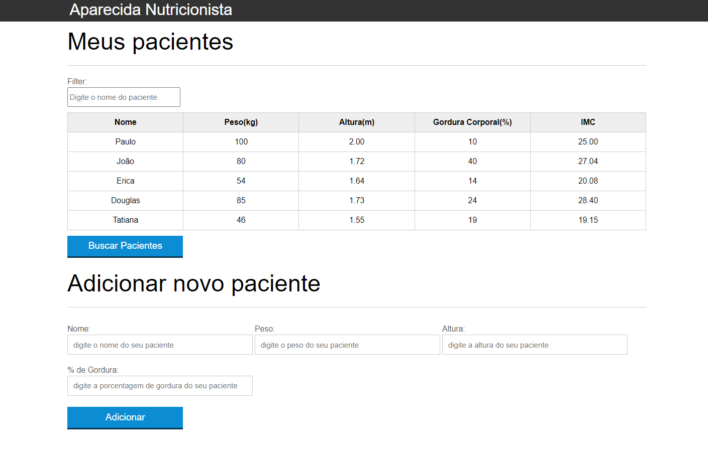

# Sistema para gerenciar pacientes

### Descrição
O projeto foi desenvolvido utilizando HTML, CSS e JS durante a trilha **Oracle ONE** na plataforma **Alura**.

### Principais funcionalidades
- [x] Exibir a listagem de todos os pacientes;
- [x] Filtrar os pacientes;
- [x] Adicionar um novo paciente;
- [x] Remoção de pacientes;
- [x] Cálculo do IMC dinamicamente de todos os pacientes;
- [x] Validação dos campos do formulário;
- [x] Requisição para buscar pacientes na API utilizando AJAX;
- [x] Tratamento de erros da chamada a API.

### A imagem abaixo apresenta o layout da página criada

